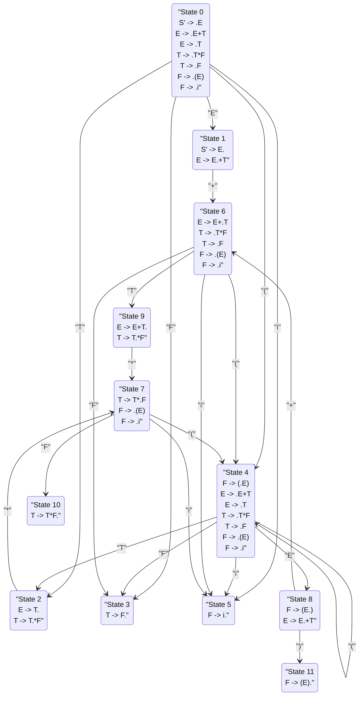

# LR(0) DFA 状态图

这个图表展示了LR(0)语法分析的DFA状态转换图。每个状态包含其项目集，箭头表示状态之间的转换及其对应的符号。

## 状态说明

- State 0: 初始状态，包含所有以点号开始的项目
- State 1: 接受状态 S' -> E. 和等待加法操作的状态
- State 2: 完成项 E -> T. 和等待乘法操作的状态
- State 3: 完成项 T -> F.
- State 4: 左括号状态，包含新的嵌套表达式开始
- State 5: 标识符完成状态
- State 6: 加法操作后等待T的状态
- State 7: 乘法操作后等待F的状态
- State 8: 括号内表达式完成，等待右括号或加法
- State 9: 加法完成后等待乘法的状态
- State 10: 乘法完成状态
- State 11: 括号表达式完成状态