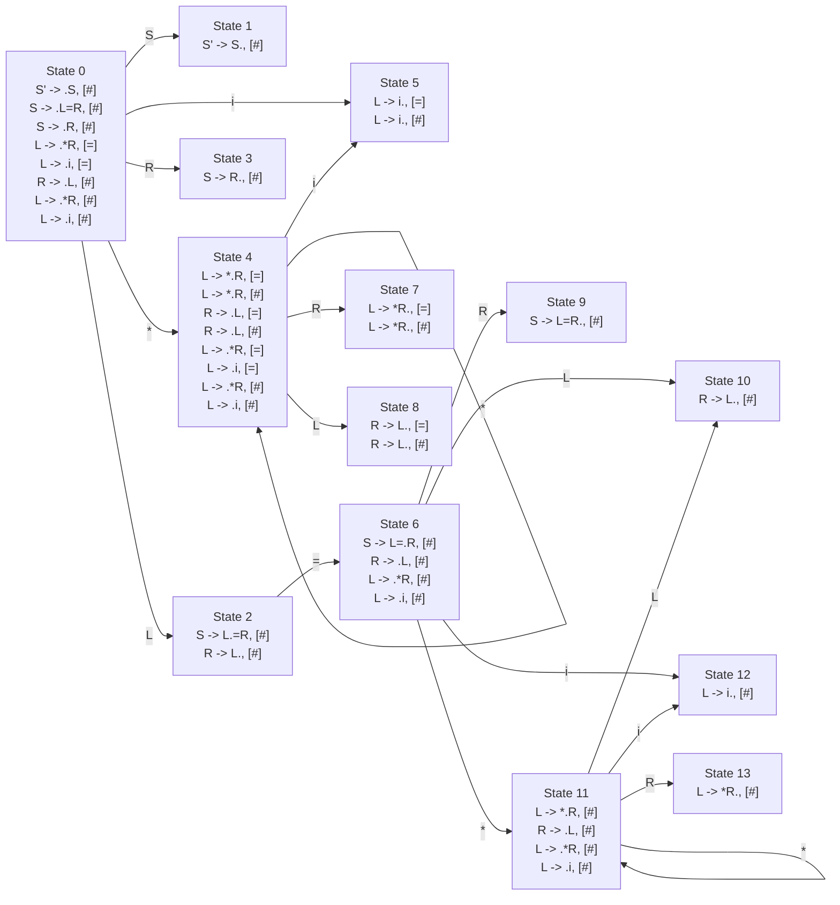

```mermaid
graph LR
    0["State 0<br/>S' -> .S, [#]<br/>S -> .L=R, [#]<br/>S -> .R, [#]<br/>L -> .*R, [=]<br/>L -> .i, [=]<br/>R -> .L, [#]<br/>L -> .*R, [#]<br/>L -> .i, [#]"]
    1["State 1<br/>S' -> S., [#]"]
    2["State 2<br/>S -> L.=R, [#]<br/>R -> L., [#]"]
    3["State 3<br/>S -> R., [#]"]
    4["State 4<br/>L -> *.R, [=]<br/>L -> *.R, [#]<br/>R -> .L, [=]<br/>R -> .L, [#]<br/>L -> .*R, [=]<br/>L -> .i, [=]<br/>L -> .*R, [#]<br/>L -> .i, [#]"]
    5["State 5<br/>L -> i., [=]<br/>L -> i., [#]"]
    6["State 6<br/>S -> L=.R, [#]<br/>R -> .L, [#]<br/>L -> .*R, [#]<br/>L -> .i, [#]"]
    7["State 7<br/>L -> *R., [=]<br/>L -> *R., [#]"]
    8["State 8<br/>R -> L., [=]<br/>R -> L., [#]"]
    9["State 9<br/>S -> L=R., [#]"]
    10["State 10<br/>R -> L., [#]"]
    11["State 11<br/>L -> *.R, [#]<br/>R -> .L, [#]<br/>L -> .*R, [#]<br/>L -> .i, [#]"]
    12["State 12<br/>L -> i., [#]"]
    13["State 13<br/>L -> *R., [#]"]

    0 -- "*" --> 4
    0 -- "L" --> 2
    0 -- "R" --> 3
    0 -- "S" --> 1
    0 -- "i" --> 5
    2 -- "=" --> 6
    4 -- "*" --> 4
    4 -- "L" --> 8
    4 -- "R" --> 7
    4 -- "i" --> 5
    6 -- "*" --> 11
    6 -- "L" --> 10
    6 -- "R" --> 9
    6 -- "i" --> 12
    11 -- "*" --> 11
    11 -- "L" --> 10
    11 -- "R" --> 13
    11 -- "i" --> 12
``` 