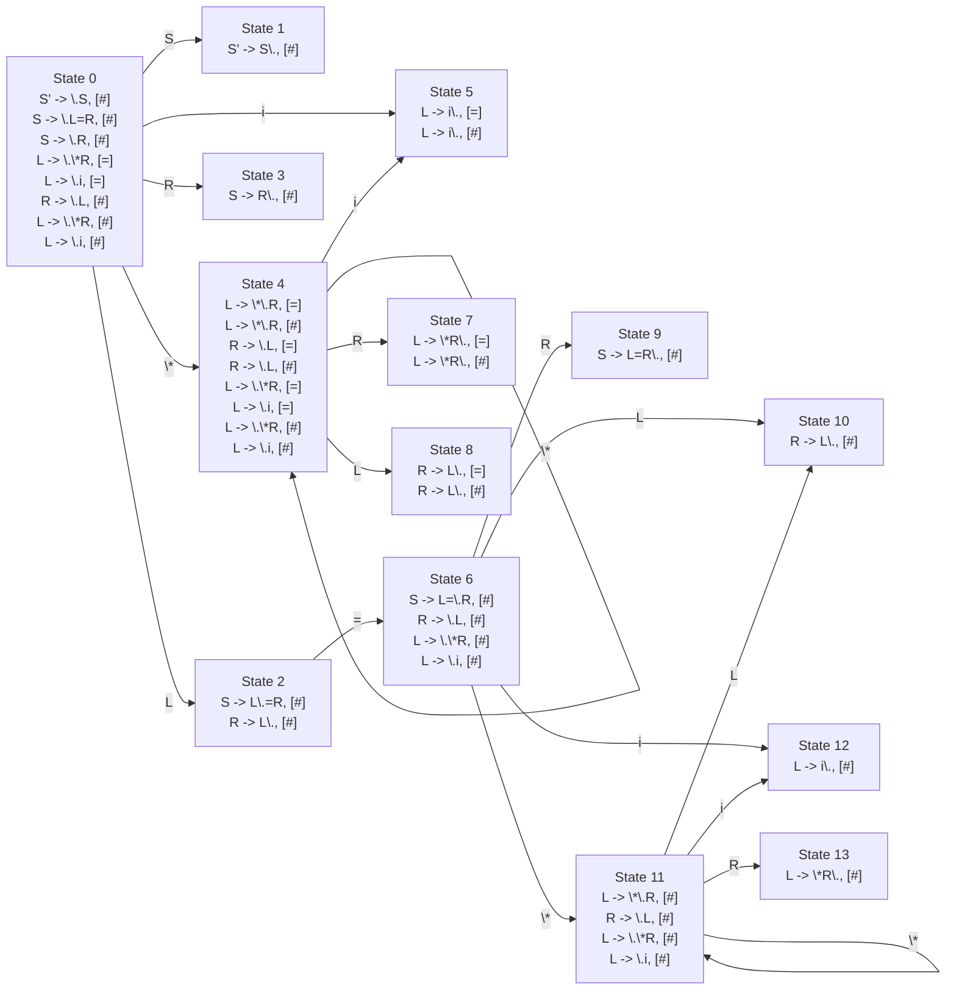

```mermaid
graph LR;
    State0["State 0<br/>S' -> \.S, [#]<br/>S -> \.L=R, [#]<br/>S -> \.R, [#]<br/>L -> \.\*R, [=]<br/>L -> \.i, [=]<br/>R -> \.L, [#]<br/>L -> \.\*R, [#]<br/>L -> \.i, [#]"];
    State1["State 1<br/>S' -> S\., [#]"];
    State2["State 2<br/>S -> L\.=R, [#]<br/>R -> L\., [#]"];
    State3["State 3<br/>S -> R\., [#]"];
    State4["State 4<br/>L -> \*\.R, [=]<br/>L -> \*\.R, [#]<br/>R -> \.L, [=]<br/>R -> \.L, [#]<br/>L -> \.\*R, [=]<br/>L -> \.i, [=]<br/>L -> \.\*R, [#]<br/>L -> \.i, [#]"];
    State5["State 5<br/>L -> i\., [=]<br/>L -> i\., [#]"];
    State6["State 6<br/>S -> L=\.R, [#]<br/>R -> \.L, [#]<br/>L -> \.\*R, [#]<br/>L -> \.i, [#]"];
    State7["State 7<br/>L -> \*R\., [=]<br/>L -> \*R\., [#]"];
    State8["State 8<br/>R -> L\., [=]<br/>R -> L\., [#]"];
    State9["State 9<br/>S -> L=R\., [#]"];
    State10["State 10<br/>R -> L\., [#]"];
    State11["State 11<br/>L -> \*\.R, [#]<br/>R -> \.L, [#]<br/>L -> \.\*R, [#]<br/>L -> \.i, [#]"];
    State12["State 12<br/>L -> i\., [#]"];
    State13["State 13<br/>L -> \*R\., [#]"];

    State0 -->|"\*"| State4;
    State0 -->|"L"| State2;
    State0 -->|"R"| State3;
    State0 -->|"S"| State1;
    State0 -->|"i"| State5;
    State2 -->|"="| State6;
    State4 -->|"\*"| State4;
    State4 -->|"L"| State8;
    State4 -->|"R"| State7;
    State4 -->|"i"| State5;
    State6 -->|"\*"| State11;
    State6 -->|"L"| State10;
    State6 -->|"R"| State9;
    State6 -->|"i"| State12;
    State11 -->|"\*"| State11;
    State11 -->|"L"| State10;
    State11 -->|"R"| State13;
    State11 -->|"i"| State12;
``` 