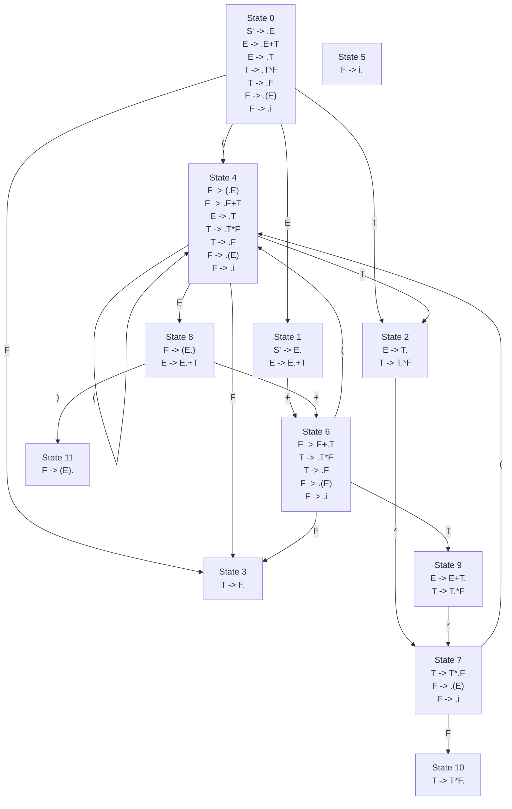

```mermaid
graph TD
    0["State 0<br>S' -> .E<br>E -> .E+T<br>E -> .T<br>T -> .T*F<br>T -> .F<br>F -> .(E)<br>F -> .i"]
    1["State 1<br>S' -> E.<br>E -> E.+T"]
    2["State 2<br>E -> T.<br>T -> T.*F"]
    3["State 3<br>T -> F."]
    4["State 4<br>F -> (.E)<br>E -> .E+T<br>E -> .T<br>T -> .T*F<br>T -> .F<br>F -> .(E)<br>F -> .i"]
    5["State 5<br>F -> i."]
    6["State 6<br>E -> E+.T<br>T -> .T*F<br>T -> .F<br>F -> .(E)<br>F -> .i"]
    7["State 7<br>T -> T*.F<br>F -> .(E)<br>F -> .i"]
    8["State 8<br>F -> (E.)<br>E -> E.+T"]
    9["State 9<br>E -> E+T.<br>T -> T.*F"]
    10["State 10<br>T -> T*F."]
    11["State 11<br>F -> (E)."]

    0 -- "( " --> 4
    0 -- "E" --> 1
    0 -- "F" --> 3
    0 -- "T" --> 2
    1 -- "+" --> 6
    2 -- "*" --> 7
    4 -- "( " --> 4
    4 -- "E" --> 8
    4 -- "F" --> 3
    4 -- "T" --> 2
    6 -- "( " --> 4
    6 -- "F" --> 3
    6 -- "T" --> 9
    7 -- "( " --> 4
    7 -- "F" --> 10
    8 -- ")" --> 11
    8 -- "+" --> 6
    9 -- "*" --> 7
``` 