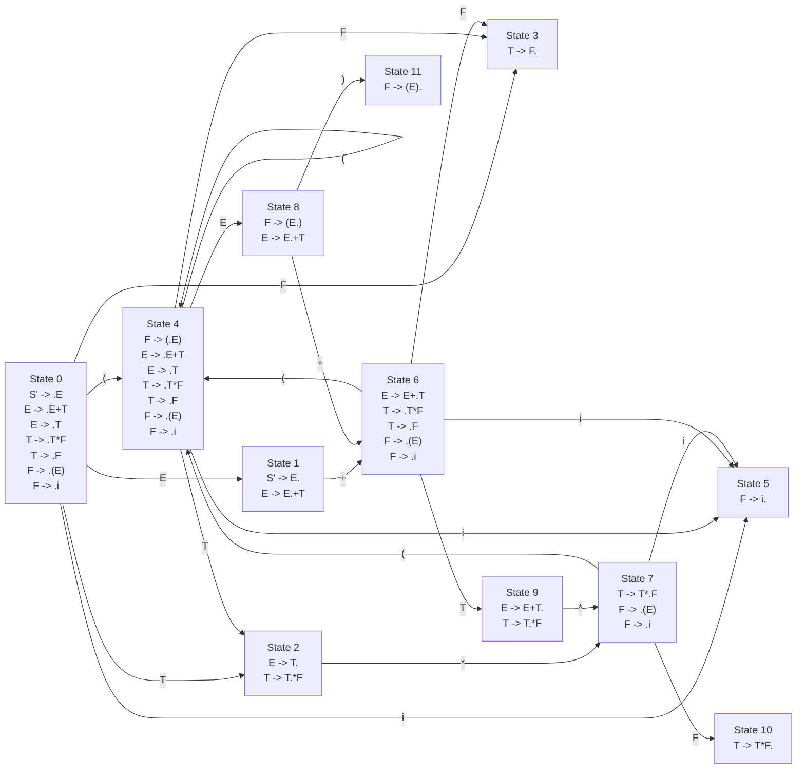

# DFA State Diagram Visualization

This diagram shows the DFA states and their transitions for the grammar. Each state contains its item set, and transitions are labeled with their corresponding symbols.

## 说明

该DFA图展示了一个用于解析算术表达式的状态机，包含以下特点：

1. 总共有12个状态（State 0-11）
2. 每个状态包含其项目集（LR(0) items）
3. 状态之间的转换用箭头标注，箭头上的标签表示转换符号
4. 初始状态为State 0
5. 图中展示了所有的产生式和它们在各个状态中的位置

主要的语法规则包括：
- 表达式（E）
- 项（T）
- 因子（F）
- 加法运算（+）
- 乘法运算（*）
- 括号表达式
- 标识符（i） 